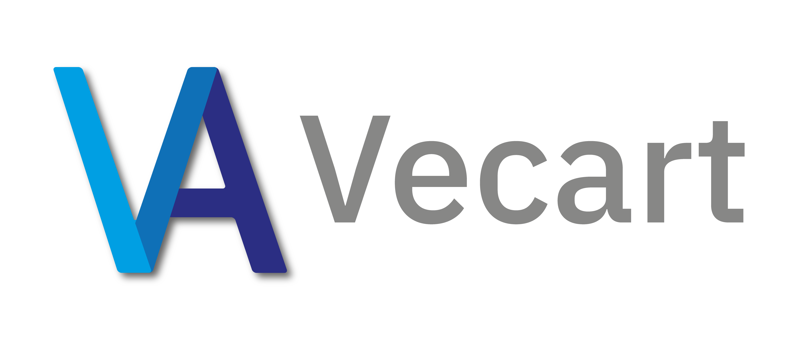
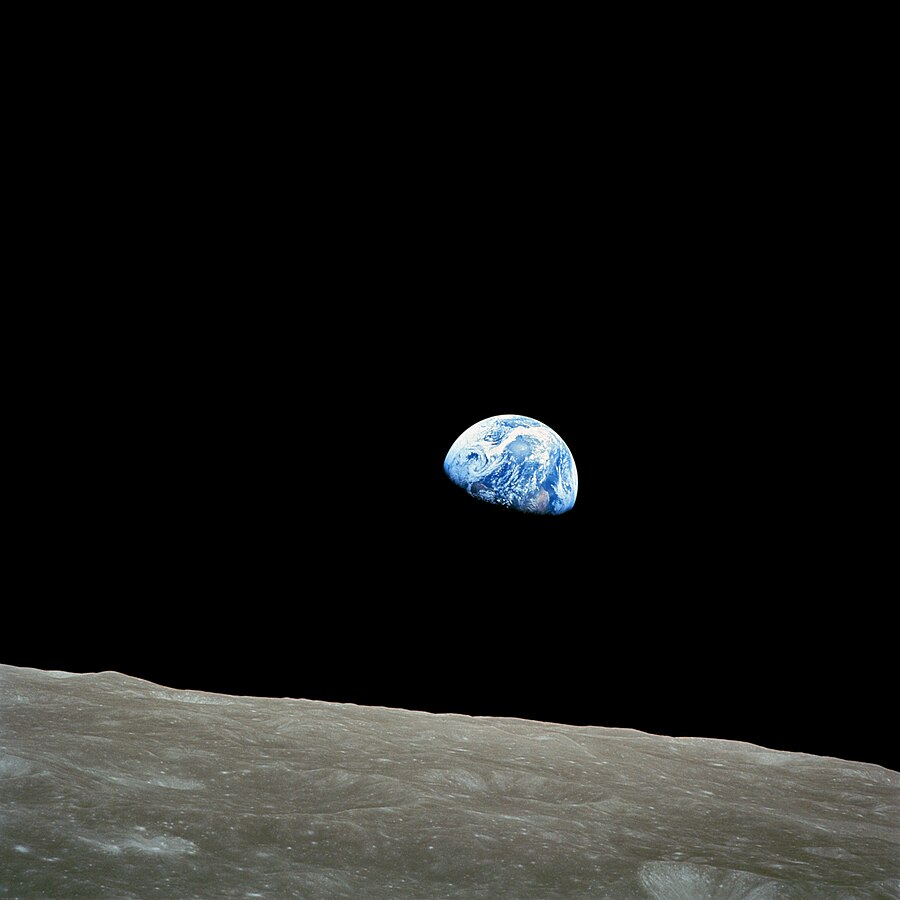
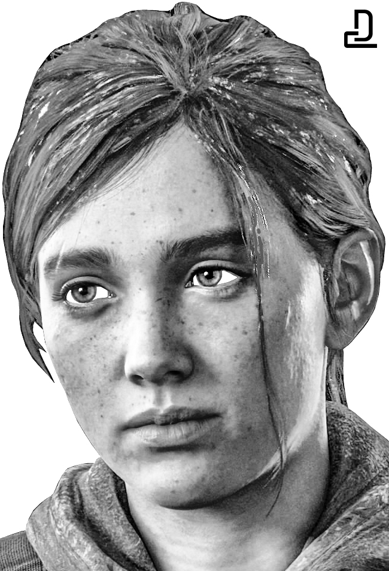
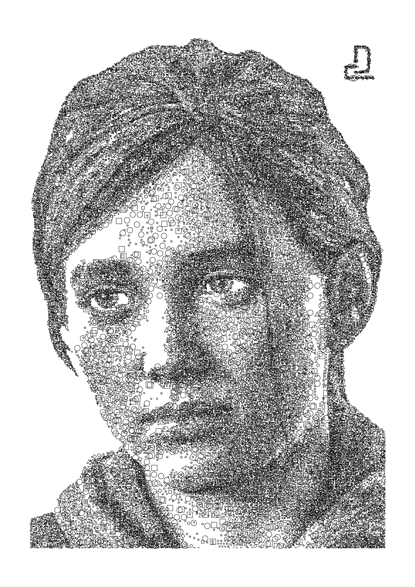
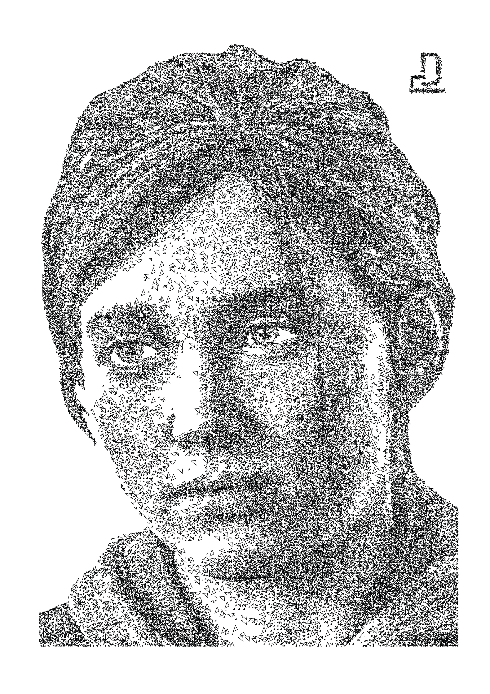
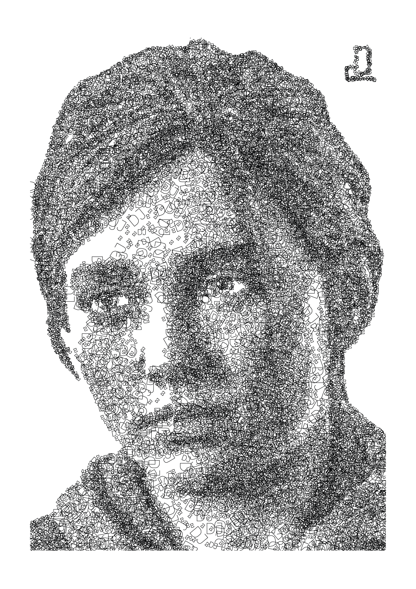

<p align="center">

</p>

Vecart is a tool for creating vector art specifically targeted at plotters or laser engravers. It can convert raster images (e.g. .png, .jpg) into vector graphics made up of abritrary shapes. This readme contains information about the usage of Vecart and some examples to get started. More general information about Vecart can be found on my blog ([david-jilg.com/vecart](https://www.david-jilg.com/vecart)).

<p align="center">

</p>

## Installation

Vecart requires no installation. Just head to the [release section](https://github.com/DavidJilg/Vecart/releases) and download the latest binary. Alternatively you can build Vecart from source by by downloading the source code and running 
`go build github.com/DavidJilg/Vecart`.


## Usage
For help run `Vecart --help`

For viewing the license run `Vecart --license`

For generating artworks run Vecart with a path to a JSON configuration 
file `Vecart /path/to/config/file/config.json`

## Configuration

Vecart can be configured with the following parameters. All parameters are optional and have standard values that are used if no value is provided.

| Parameter | Type | Standard Value | Description
| ----------- | ----------- | ----------- | ----------- |
| inputPath | String | Example Image | Relative or absolute path to the image that should be converted to vector art. Supported image formats are .png, and .jpg/jpeg  
| outputPath | String | output.svg | Relative or absolute path to a .svg file in which the artwork should be saved. It will be overidden if it already exists. 
| artworkWidth | Integer >= 0 | 255 | The width (in millimetre) of the artwork that should be generated. If 0 the width will be determined by the height of the artwork and the aspect ration of the input image.
| artworkHeight | Integer >= 0 | 370 | The height (in millimetre) of the artwork that should be generated. If 0 the height will be determined by the width of the artwork and the aspect ration of the input image.
| quadrantWidth | Integer > 0 | 5 | The width (in pixel) that each quadrant should have. A quadrant is a part of the source image. The image is split into quadrants to make the problem of placing shapes easier to solve. 
| quadrantHeight | Integer > 0 | 5 | The height (in pixel) that each quadrant should have.
| darknessThreshold | Float | 18 | Influences how many shapes have to be placed in a quadrant. Each shape reduces the darkness of a Pixel. Once the average darkness of a quadrant is below the threshold the quadrant is considered finished and no more shapes are placed in it. Completly black pixels have a initial value of 255; white pixels a value of 0.
| shapeDarknessFactor | Float > 0 | 40 | Influences how much a shape reduces the darkness of a pixel that it covers.
| whitePunishmentBoundry | Integer | 5 | Shapes that cover white pixels should be avoided. This parameter specifies what pixels count as white. The value should be between 0 and 255.
| whitePunishmentValue | Float >= 0 | 0.85 | The punishment value used to guide the heuristic that determines where shapes are placed. If a shape covers a white pixel its score gets reduced by this value.
| randomSeed | Integer >= 0 | 1701 | A seed used for the random number generator. The same seed and configuration will result in the same output (deterministic behaviour) if Vecart is run without parralel routines (i.e. multiple threads). 
| parallelRoutines | Integer > 0 | 5 | Specifies how many parralel routines (i.e. threads) run at the same time. For a deterministic result set the value to 1 (i.e. only one routine running at the same time).
| highPrecisionShapePositioning | Boolean | False | This option determines the amount of positions that are evaluated when placing shapes. If set to True it increases the computational complexity and, therefore, the runtime by the amount of pixels in a quadrant (e.g. 5x5 quadrant -> 25x runtime). Use only if you want the absolute best result Vecart can offer. In most cases this option is not necessary.
| shapeRefinement | Boolean | True | Determines if multiple passes are made when placing shapes to further refine the positioning of the shapes. 
| shapeRefinementIterations | Integer > 0 | 1 | Determines the number of passes used to refine the positioning of shapes.
| shapeRefinementPercentage | Float > 0 | 0.2 | Determines the percentage of shapes that are refined during each pass. During each pass all shapes are scored using the heuristic function and the worst shapes are removed and new shapes are placed.
| smoothEdges | Boolean | True | Determines if Shapes that overlap the boundries of the canvas are cut to create smooth edges.
| combineShapes | Boolean | True | If set to True shapes that are in close proximity of each other will be combined. This option makes it faster to plot or engrave the arwork.
| combineShapesTolerance | Float > 0 | 0.5 | Determines how close (in millimetre) two shapes must be to be combined.
| combineShapesIterations | Integer > 0 | 5 | The number of passes in which shapes are combined.
| strokeWidth | Float >= 0 | 0.75 | The stroke width of the shapes when exported to an SVG file.
| strokeColor | String | black | The color of the shapes when exported to an SVG file.
| reverseShapeOrder | Boolean | False | Determines the order of the shapes in the SVG file. If False the shapes will be ordered from top to bottom.
| configInOutput | Boolean | True | Determines if the complete configuration of Vecart is included as a comment in the SVG file.
| processingDpi | Float > 0 | 25 | Determines the resolution of the image used during the artwork generation in relation to the artwork size. A DPI of 25 roughly correlates to a 1 to 1 relation between the artwork size in mm and the resolution of the image.
| outputDpi | Float > 0| 72 | The dpi used for generating the SVG file. The value should be choosen based on what other program you want to further process the output with. For example Adobe Illustrator uses a standard dpi of 72 while Inkscape uses 96.
| timeout | Integer > 0 | 30 | In rare cases Vecart can become stuck and is not able to completly finish placing enough shapes. This timeout determines how many seconds no progress can be made without aborting the placing of shapes and exporting the current state.
| debug | Boolean | False | If set to True additional debug information will be provided in the terminal.
| shapes | Array of Objects | lines with lenghts of 2, 4, and 8 mm | The set of shapes used to generate the arwork. For more details see the following section.
| shapeAngleDeviationRange | Float >= 0 | 90 | For all provided shapes rotated variants are generated if this value is greater than 0. The rotation range in both directions (clockwise and anticlockwise) can be set with this value.
| shapeAngleDeviationStep | Float > 0 | 5 | The step value angle used to generate the rotated variants.


### Shape Definition

The following shapes are supported by Vecart and can be specified as shown in the JSON examples. All coordinates and sizes should be provided as millimetres.

- Line
   ```json
        {
            "type": "line",
            "p1": [0,0],
            "p2": [0,2]
        }
    ```
- Polyline
   ```json
        {
            "type": "polyline",
            "points": [[0,0], [0,2], [1,2]]
        }
    ```
- Triangle
   ```json
        {
            "type": "triangle",
            "p1": [0,0],
            "p2": [1,1],
            "p3": [0,2]
        }
    ```
- Rectangle
   ```json
        {
            "type": "rectangle",
            "topLeft": [0,0],
            "width": 2,
            "height": 2
        }
    ```
- Polygon
   ```json
        {
            "type": "polygon",
            "points": [[-1,0], [-0.5, 1], [0.5, 1], [1,0]]
        }
    ```
- Circle
   ```json
        {
            "type": "circle",
            "center": [0,0],
            "radius": 1
        }
    ```
- Text
   ```json
        {
            "type": "text",
            "lineHeight": 1,
            "center": [0,0],
            "text": "Test"
        }
    ```
- Group
   ```json
        {
            "type": "group",
            "shapes":[
                {
                    "type": "line",
                    "p1": [0,0],
                    "p2": [0,2]
                },
                {
                    "type": "polyline",
                    "points": [[0,0], [0,2], [1,2]]
                }
            ]
        }
    ```

#### Example Configuration with all Parameters
```json
{
    "inputPath": "/some/path/picture.png",
	"outputPath": "/some/path/art.svg",  
	"artworkWidth": 255,  
	"artworkHeight": 370, 
	"quadrantWidth": 5,          
	"quadrantHeight": 5,         
	"darknessThreshold": 18,      
	"shapeDarknessFactor": 40,    
	"whitePunishmentBoundry": 5, 
	"whitePunishmentValue": 0.85,   
	"randomSeed": 1701,             
	"parallelRoutines": 5,       
	"highPrecisionShapePositioning": false,            
	"shapeRefinement": true,            
	"shapeRefinementIterations": 1,            
	"shapeRefinementPercentage": 0.2,            
	"smoothEdges": true,            
	"combineShapes": true,          
	"combineShapesTolerance": 0.5,  
	"combineShapesIterations": 5, 
	"strokeWidth": 0.75,            
	"strokeColor": "black",            
	"reverseShapeOrder": false,      
	"configInOutput": true,         
	"processingDpi": 25,          
	"outputDpi": 72,              
	"debug": false,                  
	"timeout": 30,                  
	"shapes": [
        {
            "type": "line",
            "p1": [0,0],
            "p2": [0,2]
        },
        {
            "type": "polyline",
            "points": [[0,0], [0,2], [1,2]]
        },
        {
            "type": "polygon",
            "points": [[-1,0], [-0.5, 1], [0.5, 1], [1,0]]
        },
        {
            "type": "rectangle",
            "topLeft": [0,0],
            "width": 2,
            "height": 2
        },
        {
            "type": "triangle",
            "p1": [0,0],
            "p2": [1,1],
            "p3": [0,2]
        },
        {
            "type": "circle",
            "center": [0,0],
            "radius": 1
        },
        {
            "type": "text",
            "lineHeight": 1,
            "text": "Test"
        }
    ],               
	"shapeAngleDeviationRange": 90, 
	"shapeAngleDeviationStep": 5

}
```

## Examples
The following examples illustrate some of the capabilities of Vecart. The corresponding files can also be found in the 'examples' folder.

## Earthrise
<p align="center">

</p>
<p align="center">

</p>

```json
{
    "outputPath": "/examples/earth_rise/earth_rise.svg",
    "inputPath": "/examples/earth_rise/earth_rise_inverted.jpg",
    "darknessThreshold": 40,      
    "shapeDarknessFactor": 40,
    "artworkWidth": 1000,
    "artworkHeight": 0,
    "shapeAngleDeviationStep": 50,
    "shapes": [
        {
            "type": "circle",
            "center": [0,0],
            "radius": 0.5
        },
        {
            "type": "circle",
            "center": [0,0],
            "radius": 1
        },
        {
            "type": "circle",
            "center": [0,0],
            "radius": 2
        },
        {
            "type": "triangle",
            "p1": [0,0],
            "p2": [0.5,0.5],
            "p3": [0,1]
        },
        {
            "type": "triangle",
            "p1": [0,0],
            "p2": [1,1],
            "p3": [0,2]
        },
        {
            "type": "triangle",
            "p1": [0,0],
            "p2": [2,2],
            "p3": [0,4]
        },
        {
            "type": "rectangle",
            "topLeft": [0,0],
            "width": 1,
            "height": 1
        },
        {
            "type": "rectangle",
            "topLeft": [0,0],
            "width": 2,
            "height": 2
        },
        {
            "type": "rectangle",
            "topLeft": [0,0],
            "width": 4,
            "height": 4
        }
    ]
}
```

----

Each of following examples were generated using the following source image of Ellie Williams from The Last of Us and the configuration provided with each example.

<p align="center">

</p>


### Lines

<p align="center">

</p>

```json
{
    "outputPath": "ellie_lines.svg",
    "shapes": [
        {
            "type": "line",
            "p1": [0,0],
            "p2": [0,2]
        },
        {
            "type": "line",
            "p1": [0,0],
            "p2": [0,4]
        },
        {
            "type": "line",
            "p1": [0,0],
            "p2": [0,8]
        }
    ]
}
```

### Diverse Shapes
<p align="center">

</p>

```json
{
    "outputPath": "/examples/diverse/ellie_diverse.svg",
    "shapeAngleDeviationStep": 30,
    "shapes": [
        {
            "type": "circle",
            "center": [0,0],
            "radius": 0.5
        },
        {
            "type": "circle",
            "center": [0,0],
            "radius": 1
        },
        {
            "type": "circle",
            "center": [0,0],
            "radius": 2
        },
        {
            "type": "triangle",
            "p1": [0,0],
            "p2": [0.5,0.5],
            "p3": [0,1]
        },
        {
            "type": "triangle",
            "p1": [0,0],
            "p2": [1,1],
            "p3": [0,2]
        },
        {
            "type": "triangle",
            "p1": [0,0],
            "p2": [2,2],
            "p3": [0,4]
        },
        {
            "type": "rectangle",
            "topLeft": [0,0],
            "width": 1,
            "height": 1
        },
        {
            "type": "rectangle",
            "topLeft": [0,0],
            "width": 2,
            "height": 2
        },
        {
            "type": "rectangle",
            "topLeft": [0,0],
            "width": 4,
            "height": 4
        }
    ]
}
```


### Circles
<p align="center">

</p>

```json
{
    "outputPath": "/examples/circles/ellie_circles.svg",
    "shapes": [
        {
            "type": "circle",
            "center": [0,0],
            "radius": 0.5
        },
        {
            "type": "circle",
            "center": [0,0],
            "radius": 1
        },
        {
            "type": "circle",
            "center": [0,0],
            "radius": 2
        }
    ]
}
```

### Rectangles
<p align="center">

</p>

```json
{
    "outputPath": "/examples/rectangles/ellie_rectangles.svg",
    "shapes": [
        {
            "type": "rectangle",
            "topLeft": [0,0],
            "width": 1,
            "height": 1
        },
        {
            "type": "rectangle",
            "topLeft": [0,0],
            "width": 2,
            "height": 2
        },
        {
            "type": "rectangle",
            "topLeft": [0,0],
            "width": 4,
            "height": 4
        }
    ]
}
```

### Triangles
<p align="center">

</p>

```json
{
    "outputPath": "/examples/triangles/ellie_triangles.svg",
    "shapes": [
        {
            "type": "triangle",
            "p1": [0,0],
            "p2": [0.5,0.5],
            "p3": [0,1]
        },
        {
            "type": "triangle",
            "p1": [0,0],
            "p2": [1,1],
            "p3": [0,2]
        },
        {
            "type": "triangle",
            "p1": [0,0],
            "p2": [2,2],
            "p3": [0,4]
        }
    ]
}
```

### Text
<p align="center">

</p>

```json
{
    "outputPath": "/examples/text/ellie_text2.svg",
    "shapes": [
        {
            "type": "text",
            "center": [0,0],
            "lineHeight": 2,
            "text": "DJ"
        },
        {
            "type": "text",
            "center": [0,0],
            "lineHeight": 4,
            "text": "DJ"
        },
        {
            "type": "text",
            "center": [0,0],
            "lineHeight": 8,
            "text": "DJ"
        }
    ]
}
```

