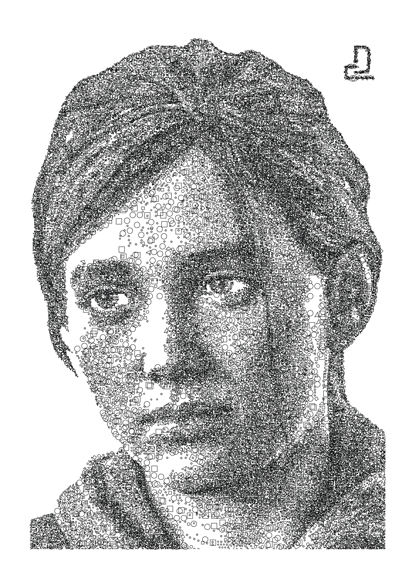
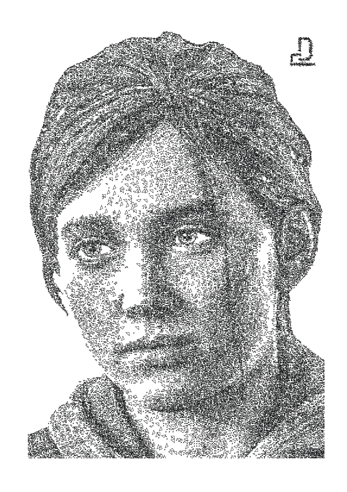
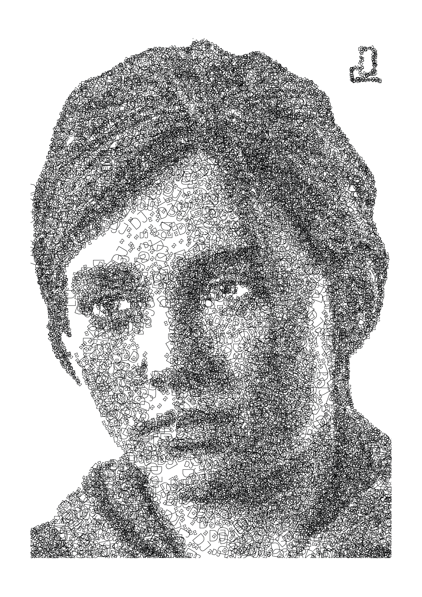

<p align="center">
  
</p>

Vecart is a command-line tool for creating vector artworks for CNC-machines, such as pen plotters or laser engravers. It has two generation modes:

- **ShapeArtGeneration** converts a raster image into an SVG assembled from configurable vector shapes.
- **GCodeGeneration** converts the geometry in an SVG file into G-code for a plotter or similar machine.

More background and project examples can be found at [david-jilg.com/vecart](https://www.david-jilg.com/vecart).

<p align="center">
  
</p>

## Installation

Download the appropriate binary from the [GitHub releases page](https://github.com/DavidJilg/Vecart/releases). No installer is required.

To build Vecart from source, install Go 1.23.1 or newer, clone the repository, and run:

```console
go build github.com/DavidJilg/Vecart
```

On Windows, use `Vecart.exe` in the commands below. On Linux, make the downloaded binary executable if necessary and invoke it as `./Vecart`.

## Usage

```text
Vecart [options] [path-to-config-or-directory ...]
```

Each positional argument can be either a JSON configuration file or a directory. Directories are searched recursively and every `.json` file is processed. Multiple files and directories can be supplied in one invocation.

```console
Vecart configs/portrait.json
Vecart configs/portrait.json configs/plotter.json
Vecart configs/
```

If no configuration is supplied, Vecart runs its embedded example configuration and image.

### Command-line options

| Option | Description |
| --- | --- |
| `--help`, `-h` | Show help and usage information. |
| `--version`, `-v` | Show the Vecart version. |
| `--license`, `-l` | Print the license. |
| `--debug`, `-d` | Enable verbose diagnostic logging. |
| `--batchSeed <count>`, `-bs <count>` | Add `<count>` variants of every loaded config with randomly generated seeds. The original config is run as well. |
| `--randomOrder`, `-ro` | Randomize the order in which loaded configs and generated variants are processed. |
| `--delayStart <seconds>`, `-ds` | Wait before starting. This is useful when Vecart is launched as part of a larger automated workflow. |
| `--updateProvedFiles`, `-u` | Developer command that regenerates the checked-in reference SVG and G-code files. See [Development](#development). |

Options and config paths may be combined, for example:

```console
Vecart -d -bs 3 configs/portrait.json
```

### Configuration files and paths

Configuration files are JSON objects. All properties are optional; omitted properties use the defaults listed below. The `mode` property selects the operation and is case-sensitive:

- `"ShapeArt"` selects ShapeArtGeneration and is the default.
- `"GCode"` selects GCodeGeneration.

Relative `inputPath` and `outputPath` values are resolved from the directory containing the configuration file, not necessarily from the shell's current directory. The `filePath` of a custom SVG shape is resolved the same way. Absolute input and output paths are also supported.

Unknown properties and invalid values are reported. Run with `--debug` to see detailed config parsing messages.

### Grid searches

Most scalar configuration properties can also be arrays. Vecart treats each value as a separate configuration and generates the Cartesian product when multiple properties are arrays. This is useful for comparing settings without creating many config files.

```json
{
    "inputPath": "portrait.jpg",
    "outputPath": "portrait.svg",
    "randomSeed": [1701, 42],
    "shapeAngleDeviationStep": [5, 10]
}
```

This example generates four configurations. Grid searches apply to the scalar string, number, and Boolean options in the mode tables, except `mode` and `outputPath`. The `shapes` and G-code command-list properties are arrays with their own meanings and are not grid-search dimensions.

## ShapeArtGeneration mode

ShapeArtGeneration analyzes the darkness of a raster image (png or jpeg) and fills it with instances of the configured shapes. It produces an SVG suitable for further editing, plotting, or engraving.

```json
{
    "mode": "ShapeArt",
    "inputPath": "portrait.jpg",
    "outputPath": "portrait.svg",
    "artworkWidth": 210,
    "artworkHeight": 0,
    "shapes": [
        { "type": "line", "p1": [0, 0], "p2": [0, 4] },
        { "type": "circle", "center": [0, 0], "radius": 1 }
    ]
}
```

Set either `artworkWidth` or `artworkHeight` to `0` to preserve the input image's aspect ratio using the other dimension. When both are non-zero, the image is resized to the requested dimensions.

### ShapeArtGeneration configuration

| Property | Type | Default | Description |
| --- | --- | --- | --- |
| `mode` | String | `"ShapeArt"` | Selects ShapeArtGeneration. |
| `inputPath` | String | `""` (embedded example image) | Raster image to process. When empty, Vecart uses its embedded example image. PNG and JPEG images are supported. |
| `outputPath` | String | `"output.svg"` | SVG output path. Relative paths are resolved from the config file. |
| `overwriteExisting` | Boolean | `false` | Overwrite an existing output file. Otherwise Vecart chooses a numbered filename. |
| `artworkWidth` | Integer >= 0 | `255` | Artwork width in millimetres. Use `0` to derive it from `artworkHeight` and the input aspect ratio. At least one dimension must be non-zero. |
| `artworkHeight` | Integer >= 0 | `370` | Artwork height in millimetres. Use `0` to derive it from `artworkWidth` and the input aspect ratio. At least one dimension must be non-zero. |
| `quadrantWidth` | Integer > 0 | `5` | Width in processing pixels of each quadrant used by the placement algorithm. |
| `quadrantHeight` | Integer > 0 | `5` | Height in processing pixels of each quadrant. |
| `darknessThreshold` | Number >= 0 | `18` | Stops placing shapes in a quadrant once its adjusted average darkness reaches this value. Black starts at `255` and white at `0`. |
| `shapeDarknessFactor` | Number > 0 | `40` | Amount by which a shape crossing a pixel reduces that pixel's adjusted darkness. Larger values generally produce fewer shapes. |
| `whitePunishmentBoundry` | Integer >= 0 | `5` | Pixels at or below this darkness are treated as white when scoring candidate placements. The spelling `Boundry` is part of the config key. |
| `whitePunishmentValue` | Number | `0.85` | Score penalty for a candidate shape that covers a white pixel. |
| `randomSeed` | Integer | `1701` | Seed for randomized placement. Use `parallelRoutines: 1` when reproducible output is required. |
| `parallelRoutines` | Integer > 0 | `5` | Number of concurrent shape-placement workers. More workers can improve speed but make placement order non-deterministic. |
| `updateFrequency` | Integer > 0 | `2` | Seconds between progress updates and timeout checks. Higher values slightly reduce logging overhead. |
| `highPrecisionShapePositioning` | Boolean | `false` | Evaluate every pixel midpoint in a quadrant instead of only its darkest position. This can multiply runtime by the number of pixels per quadrant. |
| `shapeRefinement` | Boolean | `true` | Run refinement passes after the initial placement. |
| `shapeRefinementIterations` | Integer > 0 | `1` | Number of refinement passes. |
| `shapeRefinementPercentage` | Number > 0 | `0.2` | Fraction of the lowest-scoring shapes removed and replaced during each refinement pass. |
| `smoothEdges` | Boolean | `true` | Clip shapes that cross the canvas boundary. |
| `combineShapes` | Boolean | `true` | Join nearby strokes to reduce pen-up travel and the number of exported paths. |
| `combineShapesTolerance` | Number > 0 | `0.5` | Maximum endpoint distance in millimetres for combining strokes. |
| `combineShapesIterations` | Integer > 0 | `5` | Number of combining passes. |
| `strokeWidth` | Number >= 0 | `0.75` | Stroke width written to the output SVG, in SVG output units (pixels). |
| `strokeColor` | String | `"black"` | SVG stroke color, such as `"black"` or `"#79C99E"`. |
| `backgroundColor` | String | `"NONE"` | SVG background color. `"NONE"` (case-insensitive) omits the background rectangle. |
| `reverseShapeOrder` | Boolean | `false` | Reverse the quadrant traversal order used when writing shapes to the SVG. |
| `configInOutput` | Boolean | `true` | Include the configuration as a comment in the SVG. |
| `shortConfig` | Boolean | `true` | When `configInOutput` is enabled, include only explicitly supplied properties instead of the full config. |
| `statsInOutput` | Boolean | `true` | Include shape counts and timing statistics as an SVG comment. |
| `processingDpi` | Number > 0 | `25` | Raster resolution used during generation. Higher values provide finer positioning at the cost of memory and runtime. At 25 DPI, one millimetre is approximately one processing pixel. |
| `outputDpi` | Number > 0 | `72` | Coordinate conversion used for the SVG output. `72` matches Adobe Illustrator's convention; Inkscape commonly uses `96`. |
| `timeout` | Integer > 0 | `60` | Stop placement after this many seconds without darkness progress and export the current result. Halfway to the timeout, Vecart automatically enables high-precision placement. |
| `shapes` | Array of objects | Lines of 2, 4, and 8 mm | Shape definitions available to the placement algorithm. |
| `shapeAngleDeviationRange` | Number >= 0 | `180` | Maximum clockwise and counter-clockwise rotation, in degrees, used to create variants of every configured shape. Use `0` for no rotated variants. |
| `shapeAngleDeviationStep` | Number > 0 | `10` | Angle step, in degrees, between generated rotation variants. |

### Shape definitions

All coordinates and dimensions in shape definitions are in millimetres. The following built-in shapes are supported:

| Type | Required properties | Notes |
| --- | --- | --- |
| `line` | `p1`, `p2` | Two points in the form `[x, y]`. |
| `polyline` | `points` | An array of at least three points. |
| `triangle` | `p1`, `p2`, `p3` | Three corner points. |
| `rectangle` | `topLeft`, `width`, `height` | Axis-aligned rectangle. |
| `polygon` | `points` | An array of at least three corner points; the polygon is closed automatically. |
| `circle` | `center`, `radius` | Circle center and radius. |
| `heart` | `size` | Built-in heart with the requested size. |
| `text` | `center`, `lineHeight`, `text` | Uses the embedded `IBM-Plex-Sans` single-line font. An optional `font` property can select an available embedded font. |
| `group` | `shapes` | Combines nested shape definitions into one reusable shape. |
| `svg` | `filePath`, optional `size` | Loads a custom shape from an SVG file. See [Custom SVG shapes](#custom-svg-shapes). |

Here is a configuration containing the built-in definition formats:

```json
{
    "shapes": [
        { "type": "line", "p1": [0, 0], "p2": [0, 2] },
        { "type": "polyline", "points": [[0, 0], [0, 2], [1, 2]] },
        { "type": "triangle", "p1": [0, 0], "p2": [1, 1], "p3": [0, 2] },
        { "type": "rectangle", "topLeft": [0, 0], "width": 2, "height": 2 },
        { "type": "polygon", "points": [[-1, 0], [-0.5, 1], [0.5, 1], [1, 0]] },
        { "type": "circle", "center": [0, 0], "radius": 1 },
        { "type": "heart", "size": 1 },
        { "type": "text", "center": [0, 0], "lineHeight": 2, "text": "DJ" },
        {
            "type": "group",
            "shapes": [
                { "type": "line", "p1": [0, 0], "p2": [0, 2] },
                { "type": "circle", "center": [0, 2], "radius": 1 }
            ]
        }
    ]
}
```

### Custom SVG shapes

A custom SVG shape lets ShapeArtGeneration use geometry designed in a vector editor:

```json
{
    "mode": "ShapeArt",
    "inputPath": "portrait.jpg",
    "outputPath": "portrait_hearts.svg",
    "shapes": [
        {
            "type": "svg",
            "filePath": "shapes/heart.svg",
            "size": 4
        }
    ]
}
```

`filePath` is relative to the config file. Vecart extracts the supported geometry, combines multiple SVG elements into a shape, centers it, and scales its largest dimension to `size` millimetres. If `size` is omitted, it defaults to `1`.

The supported SVG geometry and transforms are the same as in GCodeGeneration; see [Supported SVG input](#supported-svg-input). Keep custom-shape SVGs focused on geometric elements because paint, text, masks, and other presentation features are not used to build a shape.

## GCodeGeneration mode

GCodeGeneration converts SVG geometry into machine motion. Because plotters differ in how they raise a pen, switch a laser, or operate another tool, tool actions are supplied as literal G-code command lists.

```json
{
    "mode": "GCode",
    "inputPath": "drawing.svg",
    "outputPath": "drawing.gcode",
    "outputDpi": 96,
    "feedRateXY": 1200,
    "activateToolCommands": ["M3 S1000"],
    "deactivateToolCommands": ["M5"],
    "initialCommands": ["G28"],
    "finalCommands": ["M2"]
}
```

Vecart always starts generated G-code with `G90` (absolute positioning) and `G21` (millimetres), followed by `initialCommands`. For each drawable stroke it performs a rapid `G00` move to the start, emits `activateToolCommands`, draws with `G01` or `G02`, and emits `deactivateToolCommands`. `finalCommands` are appended last.

Always review and test generated G-code safely for the target machine. Vecart does not know the machine's limits, coordinate origin, tool wiring, or safe Z heights.

### GCodeGeneration configuration

| Property | Type | Default | Description |
| --- | --- | --- | --- |
| `mode` | String | `"ShapeArt"` | Set to `"GCode"` to select GCodeGeneration. |
| `inputPath` | String | `""` | SVG file to convert. This property is required in practice for GCodeGeneration. |
| `outputPath` | String | `"output.svg"` | Output file path. Use a `.gcode`, `.nc`, or other extension expected by the target workflow. |
| `overwriteExisting` | Boolean | `false` | Overwrite an existing output file. Otherwise Vecart chooses a numbered filename. |
| `outputDpi` | Number > 0 | `72` | Interprets SVG coordinate units at this DPI and converts them to millimetres. Use the DPI convention of the application that created the SVG. |
| `randomSeed` | Integer | `1701` | Seed used by `RANDOM_POS_XY` expressions in custom command lists. |
| `feedRateXY` | Integer > 0 | `100` | Feed rate written on generated `G01` line moves and `G02` circle moves. |
| `feedRateZ` | Integer > 0 | `100` | Reserved configuration value; it is accepted and serialized but is not currently applied to generated commands. Put the required feed rate directly in custom Z commands. |
| `sortGCode` | Boolean | `true` | Reorder top-level SVG shapes in a serpentine pattern to reduce travel moves. |
| `keepSVGGroups` | Boolean | `true` | Preserve SVG groups as top-level shapes. Normal drawing mode flattens groups when sorting; without sorting, and in stamp mode, this option preserves their grouping and internal order. |
| `sortAxis` | Integer | `1` | Primary sorting axis: `0` for X or `1` for Y. |
| `reverseShapeOrder` | Boolean | `false` | Reverse the final sorted shape order. It has no effect when `sortGCode` is disabled. |
| `bezierTolerance` | Number > 0 | `0.01` | Error tolerance used when approximating Bézier curves and elliptical arcs with line segments. Smaller values produce more segments and larger files. |
| `stampMode` | Boolean | `false` | Move to each shape's midpoint and activate/deactivate the tool once instead of tracing the shape. |
| `refillTool` | Boolean | `false` | Run `refillToolCommands` before the first shape and after each configured number of shapes. |
| `nrOfShapesWithoutRefill` | Integer > 0 | `1` | Number of top-level shapes processed between refills. Preserved SVG groups count as one top-level shape. |
| `refillToolCommands` | Array of strings | `[]` | Commands used to refill or service the tool. Supports `RANDOM_POS_XY`. |
| `activateToolCommands` | Array of strings | `[]` | Commands inserted after moving to the start of a stroke or stamp, such as lowering a pen or enabling a laser. |
| `deactivateToolCommands` | Array of strings | `[]` | Commands inserted after a stroke or stamp, such as raising a pen or disabling a laser. |
| `initialCommands` | Array of strings | `[]` | Commands emitted after Vecart's automatic `G90` and `G21`. Supports `RANDOM_POS_XY`. |
| `finalCommands` | Array of strings | `[]` | Commands emitted after all shapes. Supports `RANDOM_POS_XY`. |

### Supported SVG input

Vecart supports the following SVG elements:

- `rect`, including rounded rectangles with `rx` and `ry`
- `circle` and `ellipse`
- `line`, `polyline`, and `polygon`
- `path`
- nested `g` groups

SVG path commands `M`, `L`, `H`, `V`, `C`, `S`, `Q`, `T`, `A`, and `Z` are supported in absolute and relative form, including compound paths. The parser applies `translate`, `scale`, `rotate`, `skewX`, `skewY`, and `matrix` transforms, including inherited transforms on nested groups.

Elements hidden with `display: none`, an inline `display:none` style, or a CSS class that sets `display: none` are skipped during G-code generation. Unsupported elements are ignored and reported when debug logging is enabled. SVG paint and stroke styling do not control tool activation; the command-list properties do.

SVG coordinates are interpreted as pixels and converted to millimetres using `outputDpi`. The root `viewBox`, `width`, and `height` do not rescale geometry, so export the SVG at the intended coordinate scale and set the matching DPI.

### Sorting, groups, and stamp mode

With `sortGCode: true`, Vecart sorts shape start points into automatically sized bands and alternates direction between bands. `sortAxis` selects the band axis, while `reverseShapeOrder` reverses the completed ordering.

In normal drawing mode, groups are flattened for sorting so individual shapes can be reordered. If sorting is enabled, `keepSVGGroups: true` retains the SVG's internal group order. In stamp mode, preserving a group makes the whole group one stamp at its midpoint; set `keepSVGGroups: false` to stamp its child shapes individually.

### Tool refill and random positions

The refill feature can service a stamp, pen, brush, or other tool at regular intervals:

```json
{
    "mode": "GCode",
    "inputPath": "dots.svg",
    "outputPath": "dots.gcode",
    "stampMode": true,
    "refillTool": true,
    "nrOfShapesWithoutRefill": 20,
    "refillToolCommands": [
        "G00 RANDOM_POS_XY(10,10,20,10,20,20,10,20)",
        "G04 P500"
    ],
    "activateToolCommands": ["G01 Z0 F300"],
    "deactivateToolCommands": ["G01 Z5 F300"]
}
```

`RANDOM_POS_XY(x1,y1,x2,y2,x3,y3,x4,y4)` is replaced by a random `X... Y...` coordinate inside the quadrilateral formed by the four supplied points. It is available in `initialCommands`, `finalCommands`, and `refillToolCommands`, and its sequence is controlled by `randomSeed`.

## Examples

The [`examples`](examples) directory contains the source images, configs, SVG output, and previews used below. Most examples use the embedded Ellie image and change only the shape list.

### Lines

<p align="center">
  
</p>

See [`examples/lines/ellie_lines.json`](examples/lines/ellie_lines.json).

### Diverse shapes

<p align="center">
  
</p>

See [`examples/diverse/ellie_diverse.json`](examples/diverse/ellie_diverse.json).

### Circles

<p align="center">
  
</p>

See [`examples/circles/ellie_circles.json`](examples/circles/ellie_circles.json).

### Rectangles

<p align="center">
  
</p>

See [`examples/rectangles/ellie_rectangles.json`](examples/rectangles/ellie_rectangles.json).

### Triangles

<p align="center">
  
</p>

See [`examples/triangles/ellie_triangles.json`](examples/triangles/ellie_triangles.json).

### Hearts

<p align="center">
  
</p>

See [`examples/hearts/ellie_hearts.json`](examples/hearts/ellie_hearts.json).

### Text

<p align="center">
  
</p>

See [`examples/text/ellie_text2.json`](examples/text/ellie_text2.json).

### G-code

See the [G-code example configuration](static/configs/proved/gcode.json), its [stamp-mode variant](static/configs/proved/gcodeStampMode.json), and the corresponding [reference output](static/provedGCode/gcode.gcode).

## Development

### Build and test

The module targets Go 1.23.1. From the repository root:

```console
go build ./...
go test ./...
```

The main implementation is split across these packages:

- `internal/general` contains configuration handling and the generation workflows.
- `internal/svgparser` parses SVG elements, paths, groups, visibility, and transforms.
- `internal/shapes` contains geometry and SVG/G-code serialization.
- `internal/utils` contains file, unit-conversion, and G-code helpers.

Embedded runtime assets and regression fixtures live in `static`.

### Updating reference output

The developer-only `--updateProvedFiles` option regenerates both the reference SVG files in `static/provedSVG` and the reference G-code files in `static/provedGCode` from the configs in `static/configs/proved`:

```console
go run . --updateProvedFiles
```

The short form is `go run . -u`. Run this only when an intentional generator change should replace the checked-in fixtures. Review the generated diff and then run `go test ./...`.

### Building release binaries

The deployment script builds 32-bit and 64-bit Windows and Linux binaries. It reads the version from `const Version` in `main.go`, recreates `deployment/tmp`, generates the Windows icon from `images/logo.png`, and uses a Resource Hacker executable (not included in the repository due to licensing issues) to add that icon to Windows builds.

The script requires Python 3, Pillow, Go, and a Windows environment for the Resource Hacker step:

```console
python -m pip install Pillow
python deployment/deployment.py
```

Artifacts are written to `deployment/tmp` with names such as `Vecart_v2.1.0_Windows_x86-64.exe` and `Vecart_v2.1.0_Linux_x86-64`. Before a release, update the version in `main.go` and the changelog, regenerate reference output if required, run the full test suite, and then run the deployment script.

## License

Vecart is available under the [MIT License](LICENSE).
